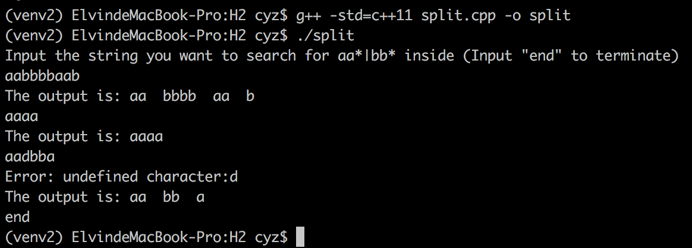

## Answer for H2

### 建立:

* 普通版本的编译命令
```sh
g++ -std=c++11 split.cpp -o split
```
*  含输出识别过程版本的编译命令
```sh
g++ -std=c++11 -DDEBUG split.cpp -o split
```
### 用法:

* 输入字符串，程序会输出满足aa\*|bb\*的子字符串。

* 当输入字符串为"end"时，程序终止。

* 当输入字符串中含有未定义字符时，程序会输出该字符并继续匹配后续的子串。

  **例:**

  

### 代码结构:

* main函数
* Split()函数
  * 输入：需要匹配目的子串的字符串
  * 输出：含有所有可匹配子串的*std::vector*

```c

vector<string> Split(string str)
{
  vector<string> str_list;
  string sub_str = string();					//sub_str为当前识别出的子串
  string::size_type i = 0;
  int state = 0;
  while(i < str.size())
  {
    switch(state)
    {
      case 0:								//状态0
        if (str[i] == 'a')						//如果下一个字符为'a',跳入状态1
        {								//如果下一个字符为'b',跳入状态2
          sub_str += "a";						//如果下一个字符未定义，报错并保持状态0
          state = 1;
          DEBUGINFO(0, 1, sub_str);
        }
        else if (str[i] == 'b')
        {
          sub_str += "b";
          state = 2;
          DEBUGINFO(0, 2, sub_str);
        }
        else
          std::cerr << "Error: undefined character:" << str[i] << std::endl;
        break;
      case 1:								//状态1
        if (str[i] == 'a')						//如果下一个字符为'a',保持状态1
        {								//如果下一个字符不是'a',回跳一个字符并进入状态0
          sub_str += "a";
          DEBUGINFO(1, 1, sub_str);
        }
        else
        {
          str_list.push_back(sub_str);
          sub_str.clear();
          state = 0;
          i--;
          DEBUGINFO(1, 0, sub_str);
        }
        break;
      case 2:								//状态2
        if (str[i] == 'b')						//如果下一个字符为'b',保持状态2
        {								//如果下一个字符不是'b',回跳一个字符并进入状态0
          sub_str += "b";
          DEBUGINFO(2, 2, sub_str);
        }
        else
        {
          str_list.push_back(sub_str);
          sub_str.clear();
          state = 0;
          i--;
          DEBUGINFO(2, 0, sub_str);
        }
        break;
    }
    i++;
  }
  if (!sub_str.empty())
    str_list.push_back(sub_str);
  return str_list;
}
```

###识别过程（例）：

```sh
aaabbbaaba
stage0 jumps to stage1	current sub string:a
stage1 remains stage1	current sub string:aa
stage1 remains stage1	current sub string:aaa
stage1 jumps to stage0	current sub string:
stage0 jumps to stage2	current sub string:b
stage2 remains stage2	current sub string:bb
stage2 remains stage2	current sub string:bbb
stage2 jumps to stage0	current sub string:
stage0 jumps to stage1	current sub string:a
stage1 remains stage1	current sub string:aa
stage1 jumps to stage0	current sub string:
stage0 jumps to stage2	current sub string:b
stage2 jumps to stage0	current sub string:
stage0 jumps to stage1	current sub string:a
The output is: aaa  bbb  aa  b  a
```
