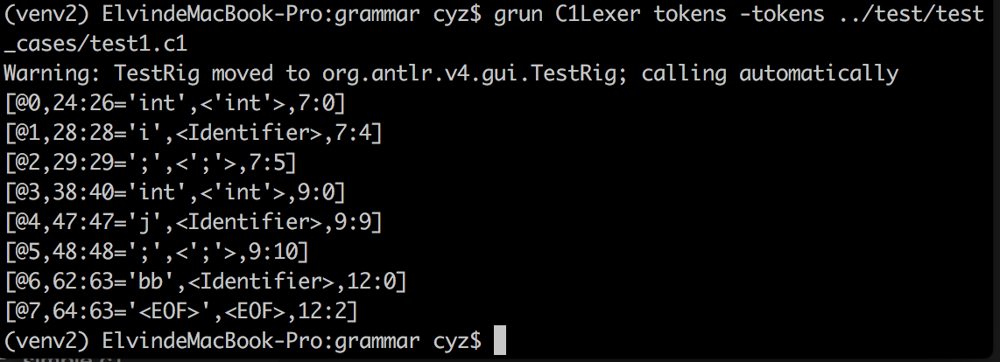

## Report for Lab1-1

##### 陈泳舟 PB15111667

###实验分析：
我们需要补全已声明的token的定义，注意到某一些常量字符串型的token优先级应高于Identifier，应适当调整tokens的优先级。
### 实验设计：

所有的token声明已事先给出，我们只需要设计定义即可

* 常量型的tokens：

  常量型的较简单，只需要直接定义即可

```
LessEqual: '<=';
Comma: ',';
```
* 标识符：

  标识符是由下划线或大小写字母开头，后接数字或下划线或大小写字母的字符串。为了代码的简洁清晰，我们定义`Character`fragment。
```
Identifier: Character (Character | [0-9])*;
fragment Character: [_a-zA-Z];
```
* 注释：

  我们需要匹配C1语言的注释，这里分为行内注释和块注释，由于注释不能被识别为token，我们需要`->skip`将其省略。

  实现块注释较简单，直接使用非贪婪的`*`匹配即可：

  ```
  BlockComment: '/*' .*? '*/' -> skip;
  ```

  而实现行注释难点在于匹配C1语言的'`\`'的断行机制：

  ```
  LineComment: '//' (.*? ~[\\]'\r'?'\n' | '\r'?'\n') -> skip;
  ```

  行内注释会用非贪婪的方法不断识别字符，直到识别到某一换行符之前的字符不是'`\`'，这意味着该行已经没有断行，识别终止。

  当然，换行符之前可能除了"`//`"外无其他字符，需要额外加上。

  > 这里的换行符指`'\r'?'\n'`以满足CRLF和LF换行机制。

### 遇到的问题：
* 不清楚token的匹配优先级是按声明顺序还是定义顺序：

  通过代码多次测试得知优先级是按照定义顺序排序。

* 在开始写行注释的时候，没有想到断行机制的本质，`LineComment`写的很冗杂，而且有的例子有错：

  `LineComment: '//' ('\\' '\r'?\n | ~[\r\n\\])*  -> skip;`

  上面的LineComment匹配无法匹配到行注释中有`\`的测例，例如：

  ```c
  int i;//\\\\\
  ```

  后来想到实验设计中的方法。

### 补充测试文件：

`test1.g1`:

主要测试了各种可能出现的注释：

块注释内带`//`：

```c
/*
  ***
  abc
  //
*/
```
行注释内，`'\'`为普通字符：
```c
int i;// \\b
```
定义内加注释：
```c
int /**/ j;
```
行注释内，`'\'`为换行符
```c
// aaa \\\
bb
```

结果为：

