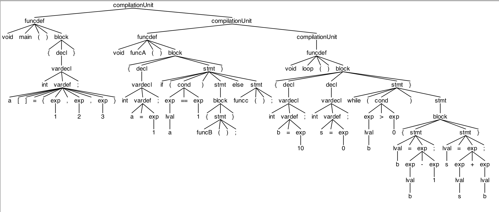
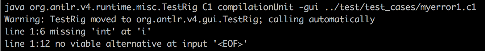
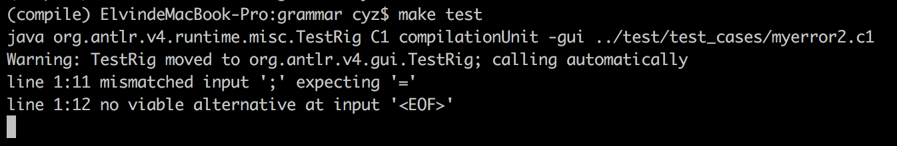

## Report for Lab1-2

##### 陈泳舟 PB15111667

### 实验分析：

本次实验我们需要结合`Lab1-1`中得到的终结符，根据C1语言的EBNF描述，修改并完善C1语言的语法描述文件`C1Parser.g4`,定义相关的非终结符并构建正确的AST树。我们需要增加正确和错误的C1测试程序，并实现C1语法分析器的可视化。

### 实验设计：

由于课程主页上EBNF描述中的非终结符的定义已经说明的很清楚，我将词法分析分为三类：

* 无左递归

  无左递归的非终结符较简单，只需要按照定义来即可，如：

  ```
  lval:
      Identifier | Identifier LeftBracket exp RightBracket
  ;
  cond:
      exp (Greater | Less | GreaterEqual | LessEqual | Equal | NonEqual) exp
  ;
  ```

  ​

* 直接左递归

  非终结符`exp`是直接左递归的，但是ANTLR支持直接左递归，所以我们只需要考虑运算符的优先级。已知运算符的优先级从上到下，在C1语言中`乘` `除` `模` 运算优先级大于`加` `减`，我们将前三种运算符放前面即可。

   ```
  exp:
      (Plus | Minus) exp
      | exp (Multiply | Divide | Modulo) exp
      | exp (Plus | Minus) exp
      | LeftParen exp RightParen
      | lval
      | Number
  ;
   ```

  ​

* 间接左递归

  `compilationUnit`的生成式如下，但这是个间接左递归，ANTLR语法不支持。

  ```
  CompUnit    → [ CompUnit ] ( Decl | FuncDef ) 
  ```

  `compilationUnit`一定是以`Decl` 或`FuncDef`开头，因此我讲它改为下面的定义，即可消除左递归。

  ```
  compilationUnit:
      (decl | funcdef)compilationUnit?
  ;
  ```

###遇到的问题：

* 由于本人的粗心，开始将终结符`Assign`与终结符`Equal`混淆，因此开始一直生成不了AST树，后来发现后改正。

### 补充测试文件：

`myfunc.c1`

主要测试了各种函数定义：

* 简单函数：

```
void main()
{
	int a[] = {1,2,3};
}
```

* 带`if`判断的函数`funcA()`

```
void funcA()
{
	int a = 1;
	if (a == 1)
	{
		funcB();
	}
	else
		funcc();
}
```

* 带`while`循环的函数`loop()`

```
void loop()
{
	int b = 10;
	int s = 0;
	while(b > 0)
	{
		b = b - 1;
		s = s + b;
	}
}
```

`myfunc.c1`AST树



然后测试了一些常见的错误：

`myerror1.c1`

* 变量声明未加`Int`类型的：

```
const i = 0;
```




`myerror2.c1`

* 数组声明变量未初始化数组大小：

```
int array[];
```
