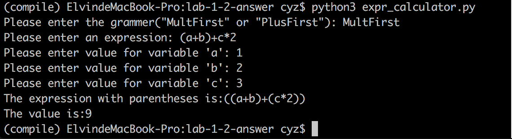
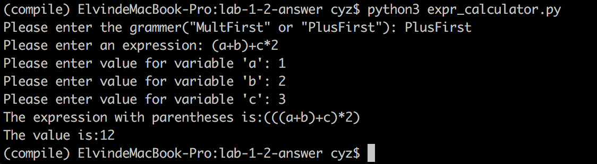

## 重点与难点：

* ANTLR 容许哪些类型的左递归？

  ANTLR支持含有直接左递归的文法。

* ANTLR 对所支持的左递归如何处理？例如，对下面两种情况分别会怎样解析？

  - `e : e '*' e # Add | e '+' e # Mult | INT # Int ;`
  - `e : e '+' e # Add | e '*' e # Mult | INT # Int ;`

  在出现多个左递归并列时，ANTLR处理运算符的优先级由上往下递减，对于前一种文法，会优先结合表达式的`*`运算符：

  

  对于后一种文法，会优先结合`+`运算符：

  

* 给出ANTLR 不支持的左递归文法的例子并尝试分析原因。

  下面是UnsupportedLeftRecursive.g4的文法

  ```
  Identifier: [a-zA-Z_] [a-zA-Z_0-9]*;
  WhiteSpace: [ \t\n\r]+ -> skip;

  expr: s 'a';
  s: expr 'b' | Identifier;
  ```

  这种含间接左递归的文法antlr是不支持的，报错为`The following sets of rules are mutually left-recursive [expr, s]`,原因应该是antlr并没有加入间接左递归转化为直接左递归的算法，导致无法识别。